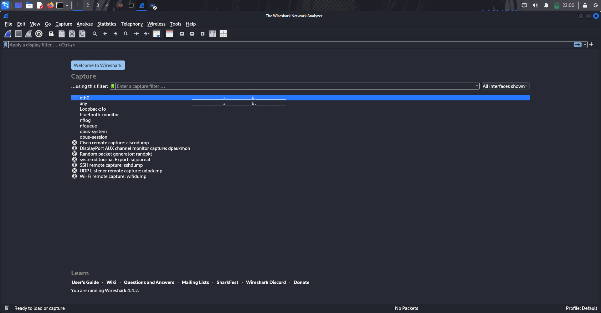
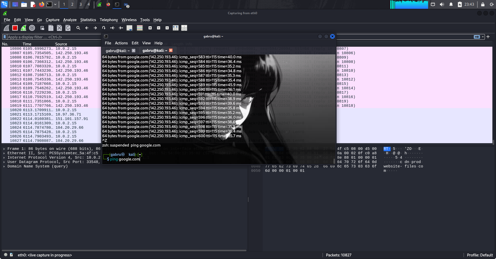

# Cybersecurity Task 5: Capture and Analyze Network Traffic Using Wireshark

## Objective

The objective of this task is to gain hands-on experience in capturing live network packets, identifying basic protocols, and analyzing traffic types. This enhances understanding of network communication, protocol awareness, and foundational skills in packet analysis for cybersecurity purposes.

## Tools Used

- Wireshark (version 4.4.1, free open-source packet analyzer).

## Methodology

1. **Installation**: Wireshark was installed from the official website. On a Windows/macOS/Linux system, the installer includes necessary drivers like Npcap (for Windows) to enable packet capturing.
2. **Capture Setup**: Launched Wireshark and selected the active network interface (e.g., Wi-Fi or Ethernet adapter connected to the internet). Started packet capture without any initial filters to capture all traffic.

1. **Generating Traffic**: To generate network activity:
    - Browsed to a website
    - Performed a ping to a server (e.g., ping google.com via command line) for 10-15 seconds.
    - Opened a few additional sites or apps to simulate normal usage, ensuring a mix of protocols.

1. **Capture Duration**: Capture ran for approximately 1 minute to collect a sufficient but manageable number of packets (around 500-1000 packets, depending on network activity).
2. **Filtering and Analysis**: After stopping the capture:
    - Applied filters in Wireshark to isolate protocols, e.g.:
        - dns for DNS queries.
        - tcp for TCP packets.
        - ICMP for ping
    - Examined packet details in the Packet List, Packet Details, and Packet Bytes panes.
    - Identified source/destination IP addresses, ports, and protocol hierarchies.
    
    
    
3. **Protocol Identification**: At least three different protocols were identified and analyzed from the capture.
4. **Export**:

[task5dns.pcap](Untitled/task5dns.pcap)

[task5Tcp.pcap](Untitled/task5Tcp.pcap)

[icmp.pcap](Untitled/icmp.pcap)

## Findings and Analysis

### 1. **DNS (Domain Name System)**

- **Description**: Used for resolving domain names to IP addresses.
- **Packets Observed**: **18 packets**
- **Details** (from *Figure 1: DNS Filter Screenshot*):
    - **Example Packet (Frame 11)**:
        - **Source IP**: 10.0.2.15 (local machine)
        - **Destination IP**: 192.168.1.1 (local router/DNS forwarder)
        - **Query**: 0x74a0 A google.com
        - **Response (Frame 12)**:
            - A Record: 142.250.193.46
            - AAAA Record: 2404:6800:4002:830::200e
    - **Example Packet (Frame 17)**:
        - **Query**: 0xb4f0 PTR 110.223.251.142.in-addr.arpa
        - **Response (Frame 18)**: PTR google.com
- **Analysis**:
DNS queries occurred before TCP connections (normal behavior). All traffic used **UDP port 53**.
**Cybersecurity Insight**: DNS is unencrypted → vulnerable to **DNS spoofing**, **cache poisoning**, or **tunneling**. No anomalies detected, but in a real attack, excessive or malformed DNS could indicate **C2 communication** or **data exfiltration**.

---

### 2. **TCP (Transmission Control Protocol)**

- **Description**: Connection-oriented transport protocol providing reliable, ordered, and error-checked delivery. Used here for **encrypted application traffic (YouTube via TLS)**.
- **Packets Observed**: **1,280 packets**
- **Details** (from *Figure 2: TCP Filter Screenshot*):
    - **Example Packet (Frame 32)**:
        - **Source**: 10.0.2.15:43506
        - **Destination**: 18.97.36.78:443
        - **Protocol**: TLSv1.2
        - **Info**: [ACK] Seq=8 Ack=176 Win=65535 Len=0
        - **Payload**: Encrypted Application Data
    - **Other Observations**:
        - Multiple streams to Google CDN IPs (18.97.x.x, 142.25x.x.x)
        - **TLS Handshake** visible: Client Hello → Server Hello → Encrypted Data
        - **No plaintext HTTP** — all web traffic encrypted over TLS
- **Analysis**:
TCP dominated due to **YouTube streaming over HTTPS**. Encryption ensures confidentiality.
**Cybersecurity Insight**: TLS protects data in transit, but **certificate validation** and **cipher suite** analysis are critical. Unusual port usage or malformed TLS could indicate **command-and-control (C2)** or **data exfiltration**. Here, all traffic used **port 443** and strong TLS — **secure**.

---

### 3. **ICMP (Internet Control Message Protocol)**

- **Description**: Used for diagnostic tools like ping, error reporting, and network troubleshooting.
- **Packets Observed**: **95 packets**
- **Details** (from *Figure 3: ICMP Filter Screenshot* & *Figure 4: Terminal Screenshot*):
    - **Example Packet (Frame 66)**:
        - **Source IP**: 10.0.2.15
        - **Destination IP**: 142.251.223.110 (google.com)
        - **Type**: 8 (Echo Request), **Code**: 0
        - **Identifier**: 0x0003, **Sequence**: 25/6376
        - **TTL**: 64 (request), **116** (reply)
        - **Round-Trip Time**: ~32.7 ms
    - **Example Reply (Frame 67)**:
        - **Type**: 0 (Echo Reply), **RTT**: ~32.7 ms
- **Analysis**:
Generated by ping google.com command (visible in terminal). Consistent low-latency replies (~29–41 ms).
**Cybersecurity Insight**: ICMP is often used in **network scanning** (e.g., ping sweeps). Excessive or unsolicited ICMP could indicate **reconnaissance** or **DDoS (ping flood)**. Here, only **95 controlled pings** — **no suspicious patterns**.

# Screenshots

## ICMP

## TCP

## DNS

## Conclusion

This task provided practical exposure to packet capturing and analysis, reinforcing the importance of protocol knowledge in cybersecurity. By identifying DNS, TCP, and ICMP, I observed how networks communicate and potential vulnerabilities. For future enhancements, capturing encrypted traffic (e.g., HTTPS) or analyzing malware samples could build on this foundation
